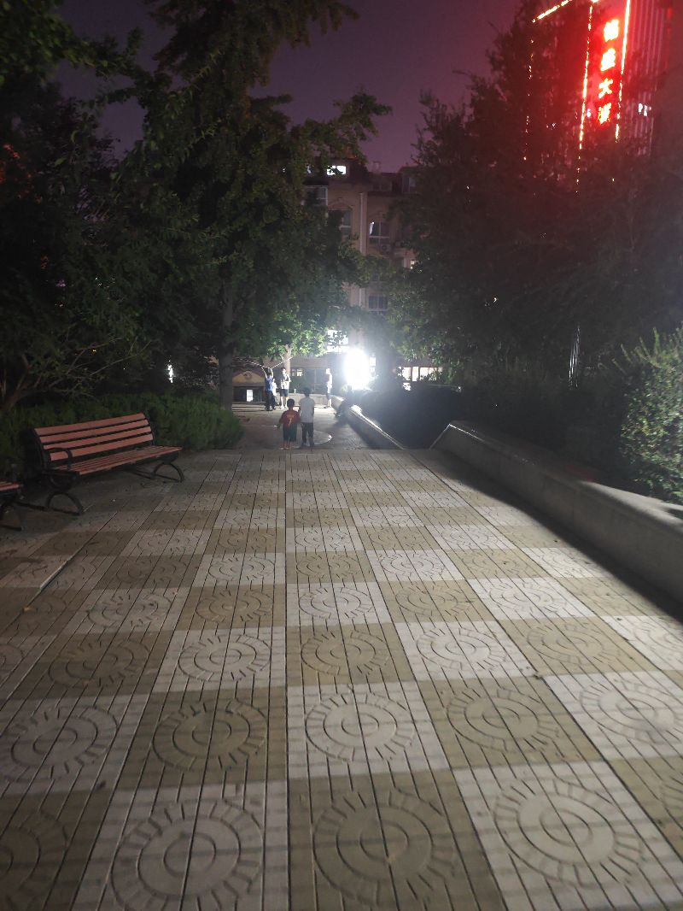

今天一直在思考，假如我们的生活中充满了各种各样的机器人，我们能感受到这种人的温暖吗，现在呢我们在大街上遇到一个不认识的人，他和我们之间没有照面关系，但是当我们向他抱以微笑的时候，他也会微笑的抱有我们这时候我们就能感受到人间的温暖，那如我们在路上遇到了很多温暖吗，因为他们是人形的，他们呢并不是对需要跟我们沟通，他们只是对我们抱以礼貌的微暖，在我们不知道他们是谁的时候，我们以人的方式去认为，那么肯定一样能够感受到温暖，所以说真正的机器人时代，我们不仅不会感到冷漠，相反，我们可能感到非常的幸福，因为在生活中我们无法判别谁是机器人，但大部分的机器人都是啊温暖的机器人，他们都能对你啊，以人类的方式提供情绪价值，这多么神奇啊，

