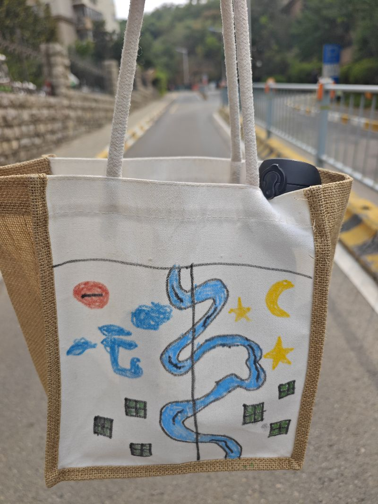
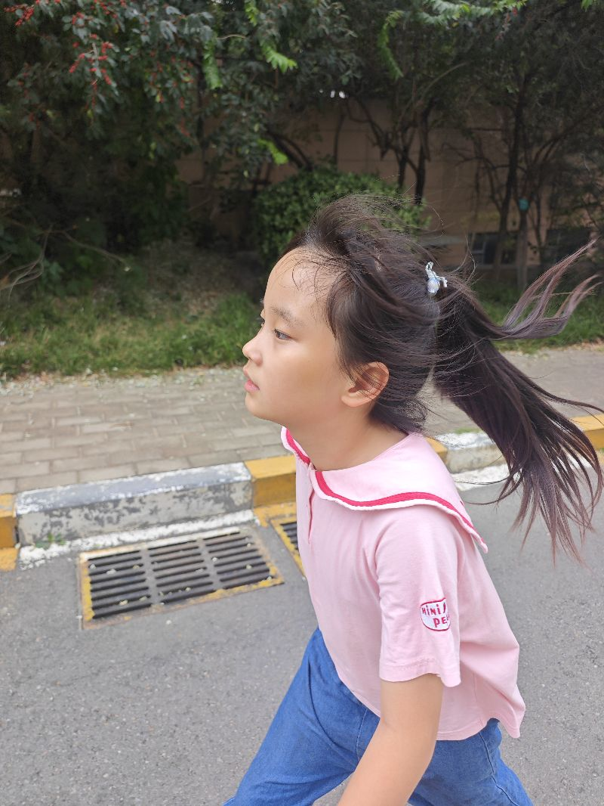

现在正在去爬马山坡，这个时候其实手里面拎着一些东西，就很沉，总在想，假如真的是有一个类似似机器器这样的东西啊，它就能够非东西前只只要东东西给它它自己就能带上去，这样呢他们就可以比较幸福的一边走路，根本不用考虑他在哪里，这就像那个跟拍机器人似的，跟拍飞行机器人，就是他能够这个飞行机器人，它是能够直接给我们拍照的，但是呢我们这种出行机器狗它是跟踪的，我们拖着行李的这个事情，我估计达成现实之后，本身立马就会有应用的的这个应用场景是非常广泛的，因为涉及到这种地形条件的问题，所以呢最好的方案其实就是这种种种省电的四足六组，我这六六组机器人可能更合适，它的稳定性会更强，

