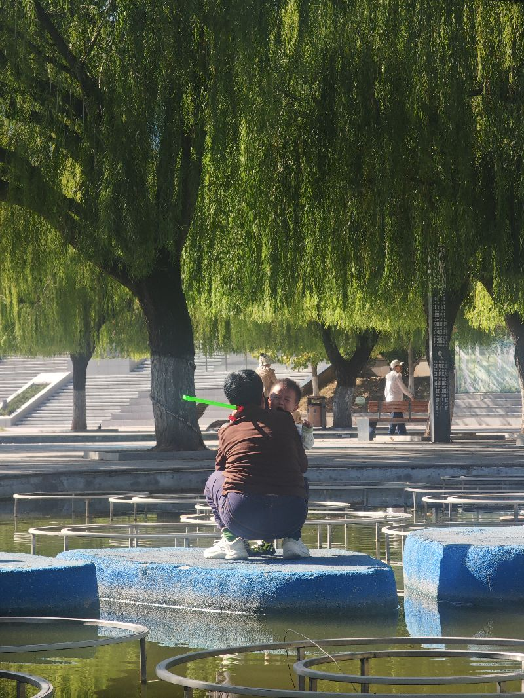

既然在思考，就顺便把机器人的部分也思考一下，这两天还是没能实现多语言的时候，再因呢可能就是自己在注册关于阿热账号的时候，当出现用他的账号的时候，自己没有能够及时填上，再回头，无论如何也进不到这个界面了，当前的解决方案呢，就是用老婆的身份再注册一个微软账号，然后用他的账号来实现付款，但是用我的信用卡绑他的账号，不知道可否可行，但知道有一一然微软用用的的信用卡，这个地方需要真正实验一下，今天就用一下，一旦用完之后，我当前所发出的任何一条关于机器人的信息都会翻译成十几种国家的语言，实现我对机器人我个赛道的思考与影响，当当人是大未来，当前看到一些观点，讲到了人形机器人基本能用，还需要十年以上的这种时间，如果没有人工智能，我完全一下，但拥有人工智能的情况下，我觉得这个时间会极限缩短，也就是当前我们看是十年，实际上五年就可以实现人工智能在两年内发生大的进步的话，我们可能只需要两点五年，当至只需要两年三个月就可以实现，当然，这里面还有生产能力的部分，这也是中国的优势，如果机器人产业超级火爆，中国呢会再次在制造业端达到自己的生产力，中价比是我们最大的武势，我样印度也有，我们总说我们抓住了在造业的这这一波大潮，所以我们啊获得了如们大的发展机会，但很可惜的是，我们又失去了更多的机会，到底什么是第一生产力，科学技术是那制度优势是不是可能更是我觉得我们完全可以在维持自足的情况下获得更多的机会，刚才看到一个奶奶在照顾孩子的时候，小朋友摔倒了，想想如果机器人照顾孩子的话，这种摔倒依然有可能，但责任归谁呢，要可能可能是人形机器人照顾家庭，真的还有很远的路要走，这里面可能是伦理问题啊，也可能是责任问题，所里面也会有很多的风险发生自己的奶奶，照看自己的亲孙子都会发生这样的一些伤害，更何况机器人呢更漫漫其修远兮，我们只能上下而求索，

